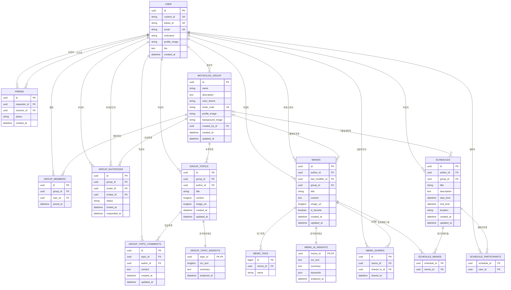
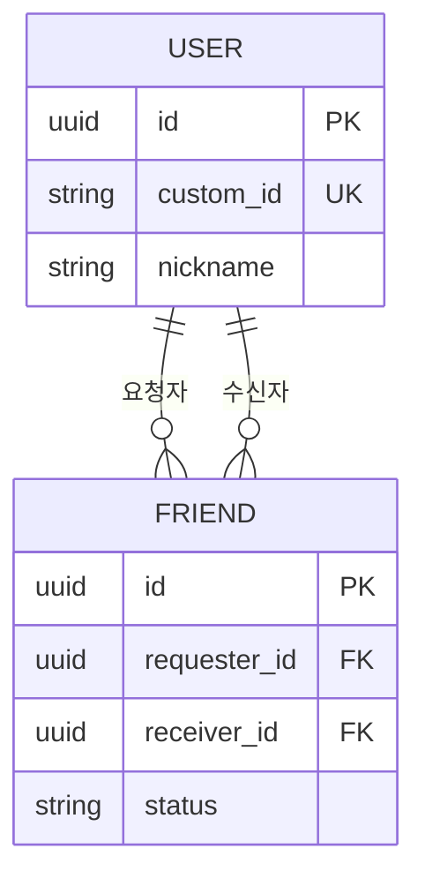
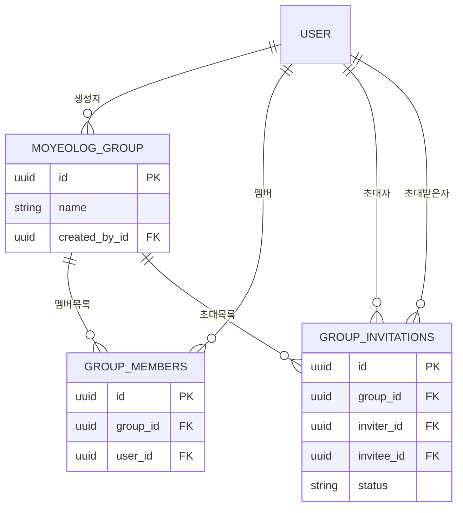
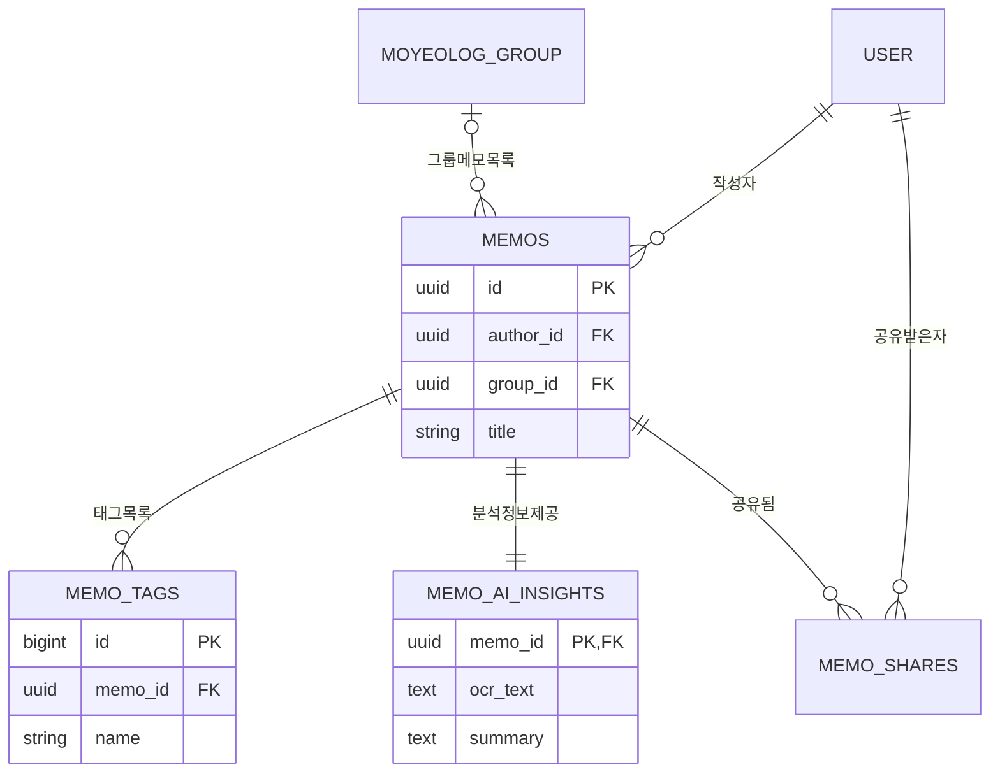
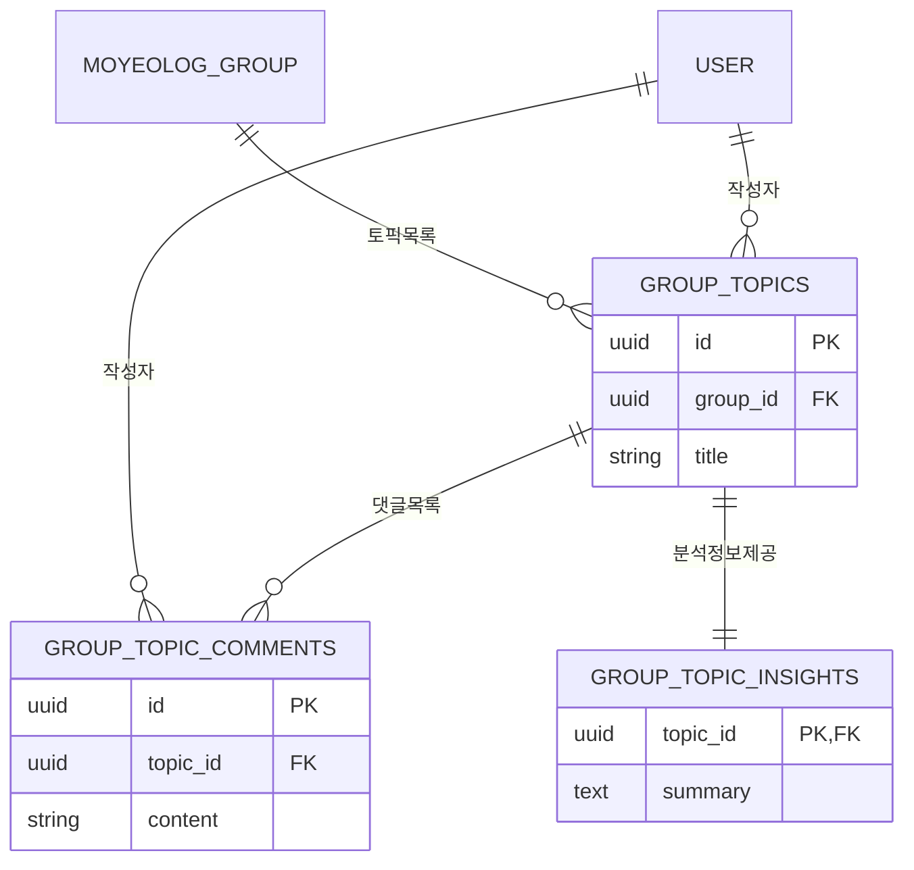
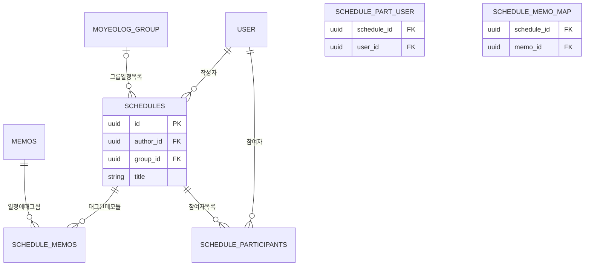

# MOYEOLOG Entity Relationship Diagram (ERD)

이 문서는 MOYEOLOG 프로젝트의 데이터베이스 설계 및 엔티티 간의 관계를 정의합니다.

## 1. ERD (Mermaid)

## 2. 관계별 세부 ERD

### 2.1 사용자 및 친구 관계 (User & Friends)

사용자 계정과 친구 요청/관계를 관리하는 구조입니다.

### 2.2 모임 및 협업 (Groups & Collaboration)

모임 생성, 멤버 관리, 초대 시스템을 포함하는 구조입니다.

### 2.3 메모 및 AI 인사이트 (Memos & AI Insights)

사용자의 메모 작성, 태그, 공유 및 AI 분석 결과 관리 구조입니다.

### 2.4 모임 토픽 및 소통 (Group Topics & Communication)

모임 내 토론 주제와 댓글, 그리고 그에 대한 AI 분석 구조입니다.

### 2.5 일정 관리 (Schedules)

개인/그룹 일정과 참여자, 연관 메모를 관리하는 구조입니다.

## 3. 테이블 설명

| 테이블명                  | 설명                                                  | 비고                         |
| :------------------------ | :---------------------------------------------------- | :--------------------------- |
| **USER**                  | 사용자 정보를 관리 (카카오 로그인 연동)               | `custom_id`로 친구 검색 가능 |
| **FRIEND**                | 사용자 간의 친구 관계 및 상태(PENDING, ACCEPTED) 관리 |                              |
| **MOYEOLOG_GROUP**        | 모임(그룹) 정보 관리                                  |                              |
| **GROUP_MEMBERS**         | 모임에 가입된 멤버 매핑 (USER와 GROUP의 N:M 관계)     |                              |
| **GROUP_INVITATIONS**     | 모임 초대 요청 및 상태 관리                           |                              |
| **MEMOS**                 | 사용자가 작성한 메모 정보 관리 (개인/그룹 공용)       |                              |
| **MEMO_TAGS**             | 메모에 부여된 태그 관리                               |                              |
| **MEMO_AI_INSIGHTS**      | Gemini AI를 통해 분석된 메모의 OCR, 요약, 키워드 정보 | MEMO와 1:1 관계              |
| **MEMO_SHARES**           | 메모를 다른 사용자에게 공유한 이력                    |                              |
| **GROUP_TOPICS**          | 모임 내의 토론 주제(토픽) 정보                        |                              |
| **GROUP_TOPIC_COMMENTS**  | 토픽에 작성된 댓글 정보                               |                              |
| **GROUP_TOP_INSIGHTS**    | 토픽의 이미지 분석 및 요약 정보                       | GROUP_TOPIC과 1:1 관계       |
| **SCHEDULES**             | 개인 및 모임 일정 정보                                |                              |
| **SCHEDULE_MEMOS**        | 일정에 연결된 관련 메모 (N:M)                         |                              |
| **SCHEDULE_PARTICIPANTS** | 일정에 참여하는 사용자 (N:M)                          |                              |

## 3. 주요 관계 설명 (Relationships)

### 3.1 1:N 관계

- **USER : MEMOS (1:N)**: 한 사용자는 여러 개의 메모를 작성할 수 있습니다.
- **MOYEOLOG_GROUP : GROUP_TOPICS (1:N)**: 하나의 모임 내에 여러 개의 토픽이 존재할 수 있습니다.
- **MEMOS : MEMO_TAGS (1:N)**: 한 메모는 여러 개의 태그를 가질 수 있습니다.
- **GROUP_TOPICS : GROUP_TOPIC_COMMENTS (1:N)**: 하나의 토픽에 여러 개의 댓글이 달릴 수 있습니다.

### 3.2 1:1 관계

- **MEMOS : MEMO_AI_INSIGHTS (1:1)**: 하나의 메모는 하나의 AI 분석 결과(OCR, 요약 등)를 가집니다.
- **GROUP_TOPICS : GROUP_TOPIC_INSIGHTS (1:1)**: 하나의 토픽은 하나의 AI 분석 결과를 가집니다.

### 3.3 N:M 관계 (매핑 테이블)

- **USER : MOYEOLOG_GROUP (N:M)**: `GROUP_MEMBERS` 테이블을 통해 다대다 관계를 형성합니다. 사용자는 여러 모임에 가입할 수 있고, 모임은 여러 멤버를 가질 수 있습니다.
- **SCHEDULES : MEMOS (N:M)**: `SCHEDULE_MEMOS` 테이블을 통해 일정이 여러 메모를 참조하거나, 메모가 여러 일정에 연결될 수 있습니다.
- **SCHEDULES : USER (N:M)**: `SCHEDULE_PARTICIPANTS` 테이블을 통해 한 일정에 참여자가 있을 수 있습니다.

### 3.4 자기 참조 및 복합 관계

- **USER : FRIEND**: 사용자가 신청자(요청자)이거나 수신자인 형태로 친구 관계를 맺습니다.
- **MEMOS (작성자 / 최종수정자)**: 메모는 작성자(`author_id`)와 마지막 수정자(`last_modifier_id`)를 각각 USER와 연결하여 이력을 관리합니다.
