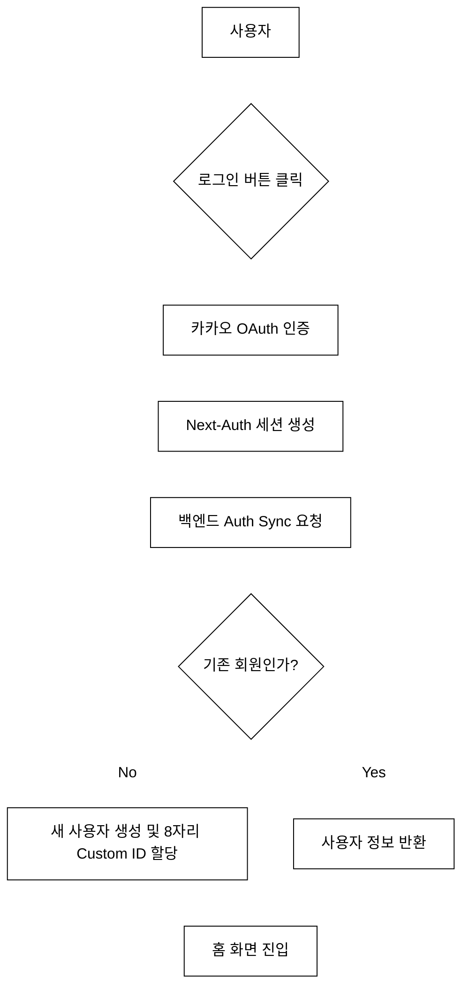
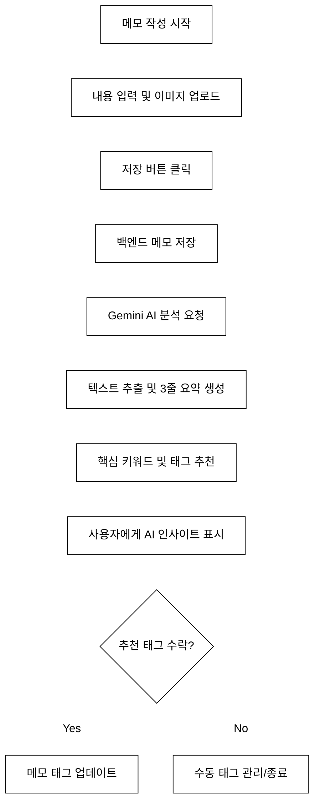
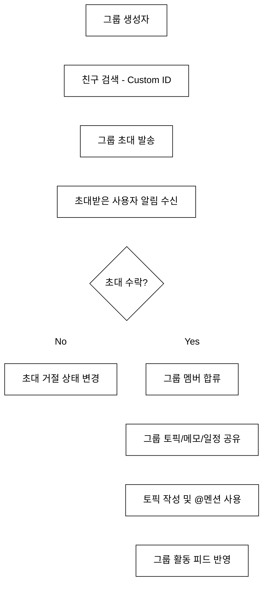
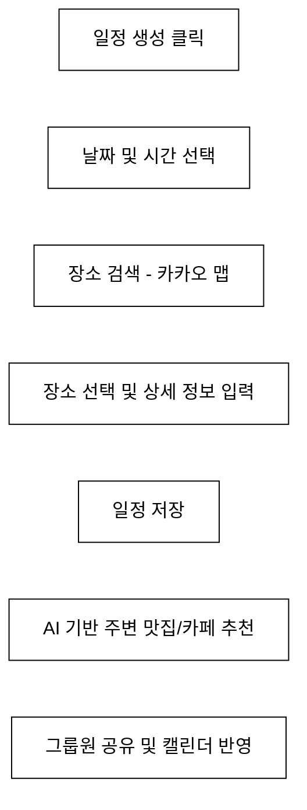

# MOYEOLOG 서비스 흐름도 (Flowchart)

이 문서는 MOYEOLOG 프로젝트의 주요 사용자 시나리오 및 데이터 흐름을 Mermaid 다이어그램으로 정의합니다.

## 1. 회원가입 및 로그인 플로우
사용자가 카카오 로그인을 통해 서비스에 진입하고 커스텀 ID를 할당받는 과정입니다.



## 2. 메모 작성 및 AI 분석 플로우
메모를 작성하고 Gemini AI를 통해 인사이트(요약, 태그 추천)를 얻는 과정입니다.



## 3. 그룹 초대 및 활동 플로우
친구를 그룹에 초대하고 토픽(Topic)을 통해 소통하는 과정입니다.



## 4. 일정 생성 및 장소 추천 플로우
일정을 등록하고 주변 장소를 추천받는 과정입니다.



## 5. 사이트 경로 (Site Map)

```mermaid
%%{init: {'theme': 'base', 'themeVariables': { 'primaryColor': '#ffffff', 'primaryTextColor': '#000000', 'primaryBorderColor': '#000000', 'lineColor': '#ffffff', 'secondaryColor': '#ffffff', 'tertileColor': '#ffffff'}}}%%
graph TD
    Root[/] --> Home[/home]
    
    Home --> Memo[/memo]
    Memo --> MemoDetail[/memo/id]
    
    Home --> Groups[/groups]
    Groups --> GroupDetail[/groups/id]
    
    Home --> Schedule[/schedule]
    Home --> Friends[/friends]
    Home --> Notifications[/notifications]
    Home --> Profile[/profile/id]
    Home --> Settings[/settings]
    
    Notifications --> InviteFriend[/invite/friend]
    Notifications --> InviteGroup[/invite/group]
```
