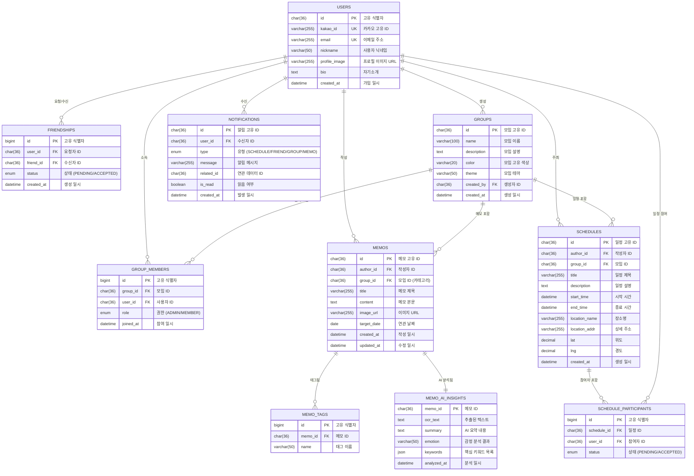

# 🚀 MOYEOLOG (모여로그) 데이터베이스 설계서

본 문서는 모여로그 서비스의 데이터베이스 구조, 엔티티 간의 관계(ERD) 및 MySQL 기준의 DDL 스크립트를 포함합니다.

## 1. ERD (Entity Relationship Diagram)



## 2. 테이블 명세

### 2.1 사용자 및 관계
- **`users`**: 카카오 소셜 로그인을 기반으로 한 사용자 정보.
- **`friendships`**: 사용자 간의 친구 요청 및 수락 상태 관리.

### 2.2 모임 (Groups)
- **`groups`**: 사용자들이 생성한 모임. 고유 컬러와 테마 정보를 저장하여 UI에 반영.
- **`group_members`**: 모임에 소속된 멤버와 권한(방장/일반) 관리.

### 2.3 메모 (Memos)
- **`memos`**: 텍스트, 이미지, 태그를 포함한 메모. 특정 모임(카테고리)에 속할 수 있음.
- **`memo_tags`**: 메모 검색 및 분류를 위한 태그.
- **`memo_ai_insights`**: AI가 분석한 OCR 텍스트, 요약, 감정, 키워드 데이터.

### 2.4 일정 (Schedules)
- **`schedules`**: 개인 또는 그룹의 일정. 장소 정보(위도/경도 포함) 저장.
- **`schedule_participants`**: 일정에 초대된 멤버들의 수락 상태.

### 2.5 알림 (Notifications)
- **`notifications`**: 활동 발생 시 사용자에게 전달되는 알림 히스토리.

## 3. SQL DDL (MySQL 기준)

```sql
-- 1. Users
CREATE TABLE users (
    id CHAR(36) PRIMARY KEY,
    kakao_id VARCHAR(255) UNIQUE NOT NULL,
    email VARCHAR(255) UNIQUE,
    nickname VARCHAR(50) NOT NULL,
    profile_image VARCHAR(255),
    bio TEXT,
    created_at DATETIME DEFAULT CURRENT_TIMESTAMP
) ENGINE=InnoDB;

-- 2. Friendships
CREATE TABLE friendships (
    id BIGINT AUTO_INCREMENT PRIMARY KEY,
    user_id CHAR(36) NOT NULL,
    friend_id CHAR(36) NOT NULL,
    status ENUM('PENDING', 'ACCEPTED') DEFAULT 'PENDING',
    created_at DATETIME DEFAULT CURRENT_TIMESTAMP,
    CONSTRAINT fk_friend_user FOREIGN KEY (user_id) REFERENCES users(id) ON DELETE CASCADE,
    CONSTRAINT fk_friend_target FOREIGN KEY (friend_id) REFERENCES users(id) ON DELETE CASCADE,
    UNIQUE(user_id, friend_id)
) ENGINE=InnoDB;

-- 3. Groups
CREATE TABLE groups (
    id CHAR(36) PRIMARY KEY,
    name VARCHAR(100) NOT NULL,
    description TEXT,
    color VARCHAR(20),
    theme VARCHAR(50),
    created_by CHAR(36),
    created_at DATETIME DEFAULT CURRENT_TIMESTAMP,
    CONSTRAINT fk_group_creator FOREIGN KEY (created_by) REFERENCES users(id) ON DELETE SET NULL
) ENGINE=InnoDB;

-- 4. Group Members
CREATE TABLE group_members (
    id BIGINT AUTO_INCREMENT PRIMARY KEY,
    group_id CHAR(36) NOT NULL,
    user_id CHAR(36) NOT NULL,
    role ENUM('ADMIN', 'MEMBER') DEFAULT 'MEMBER',
    joined_at DATETIME DEFAULT CURRENT_TIMESTAMP,
    CONSTRAINT fk_gm_group FOREIGN KEY (group_id) REFERENCES groups(id) ON DELETE CASCADE,
    CONSTRAINT fk_gm_user FOREIGN KEY (user_id) REFERENCES users(id) ON DELETE CASCADE,
    UNIQUE(group_id, user_id)
) ENGINE=InnoDB;

-- 5. Memos
CREATE TABLE memos (
    id CHAR(36) PRIMARY KEY,
    author_id CHAR(36) NOT NULL,
    group_id CHAR(36), -- NULL이면 개인 메모, 값이 있으면 해당 모임 메모(카테고리 역할)
    title VARCHAR(255) NOT NULL,
    content TEXT,
    image_url VARCHAR(255),
    target_date DATE,
    created_at DATETIME DEFAULT CURRENT_TIMESTAMP,
    updated_at DATETIME DEFAULT CURRENT_TIMESTAMP ON UPDATE CURRENT_TIMESTAMP,
    CONSTRAINT fk_memo_author FOREIGN KEY (author_id) REFERENCES users(id) ON DELETE CASCADE,
    CONSTRAINT fk_memo_group FOREIGN KEY (group_id) REFERENCES groups(id) ON DELETE SET NULL
) ENGINE=InnoDB;

-- 6. Memo Tags
CREATE TABLE memo_tags (
    id BIGINT AUTO_INCREMENT PRIMARY KEY,
    memo_id CHAR(36) NOT NULL,
    name VARCHAR(50) NOT NULL,
    CONSTRAINT fk_tag_memo FOREIGN KEY (memo_id) REFERENCES memos(id) ON DELETE CASCADE
) ENGINE=InnoDB;

-- 7. Memo AI Insights
CREATE TABLE memo_ai_insights (
    memo_id CHAR(36) PRIMARY KEY,
    ocr_text TEXT,
    summary TEXT,
    emotion VARCHAR(50),
    keywords JSON,
    analyzed_at DATETIME DEFAULT CURRENT_TIMESTAMP,
    CONSTRAINT fk_ai_memo FOREIGN KEY (memo_id) REFERENCES memos(id) ON DELETE CASCADE
) ENGINE=InnoDB;

-- 8. Schedules
CREATE TABLE schedules (
    id CHAR(36) PRIMARY KEY,
    author_id CHAR(36) NOT NULL,
    group_id CHAR(36),
    title VARCHAR(255) NOT NULL,
    description TEXT,
    start_time DATETIME NOT NULL,
    end_time DATETIME NOT NULL,
    location_name VARCHAR(255),
    location_addr VARCHAR(255),
    lat DECIMAL(10, 8),
    lng DECIMAL(11, 8),
    created_at DATETIME DEFAULT CURRENT_TIMESTAMP,
    CONSTRAINT fk_schedule_author FOREIGN KEY (author_id) REFERENCES users(id) ON DELETE CASCADE,
    CONSTRAINT fk_schedule_group FOREIGN KEY (group_id) REFERENCES groups(id) ON DELETE CASCADE
) ENGINE=InnoDB;

-- 9. Schedule Participants
CREATE TABLE schedule_participants (
    id BIGINT AUTO_INCREMENT PRIMARY KEY,
    schedule_id CHAR(36) NOT NULL,
    user_id CHAR(36) NOT NULL,
    status ENUM('PENDING', 'ACCEPTED') DEFAULT 'PENDING',
    CONSTRAINT fk_sp_schedule FOREIGN KEY (schedule_id) REFERENCES schedules(id) ON DELETE CASCADE,
    CONSTRAINT fk_sp_user FOREIGN KEY (user_id) REFERENCES users(id) ON DELETE CASCADE,
    UNIQUE(schedule_id, user_id)
) ENGINE=InnoDB;

-- 10. Notifications
CREATE TABLE notifications (
    id CHAR(36) PRIMARY KEY,
    user_id CHAR(36) NOT NULL,
    type ENUM('SCHEDULE', 'FRIEND', 'GROUP', 'MEMO') NOT NULL,
    message VARCHAR(255) NOT NULL,
    related_id CHAR(36),
    is_read BOOLEAN DEFAULT FALSE,
    created_at DATETIME DEFAULT CURRENT_TIMESTAMP,
    CONSTRAINT fk_noti_user FOREIGN KEY (user_id) REFERENCES users(id) ON DELETE CASCADE
) ENGINE=InnoDB;
