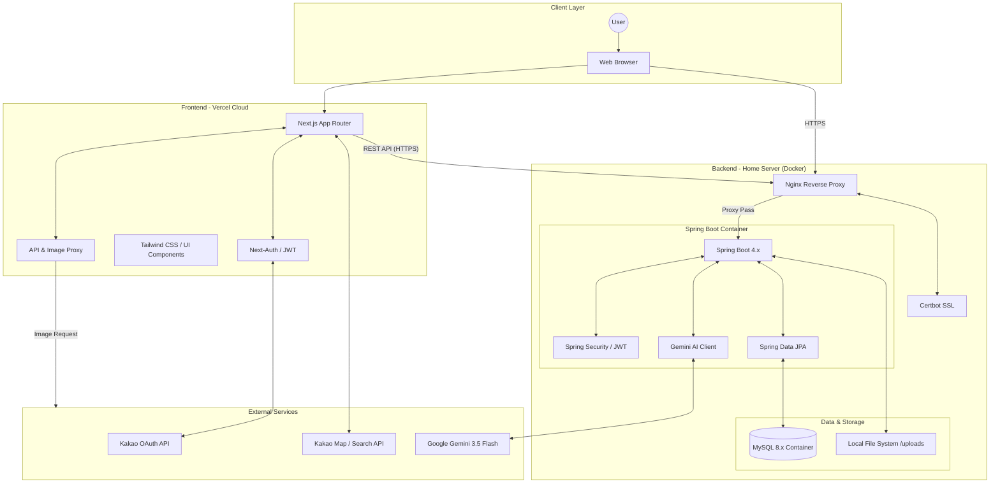

# MOYEOLOG 시스템 구조도 (System Architecture)

이 문서는 MOYEOLOG의 전체적인 하드웨어/소프트웨어 계층 구조와 구성 요소 간의 상호작용을 정의합니다.

## 1. 전체 시스템 아키텍처

## 2. 계층별 상세 설명

### 2.1 Presentation Layer (Next.js on Vercel)

- **Framework:** Next.js 15 (App Router)를 사용하여 SSR 및 Client Component를 혼합 활용.
- **Authentication:** `next-auth`를 통해 카카오 OAuth 로그인 구현 및 JWT 세션 관리.
- **State Management:** 서버 액션 및 클라이언트 상태(React Hooks)를 통한 효율적인 데이터 처리.
- **Proxy:** 외부 이미지 로딩 시 발생하는 403 에러 방지를 위해 서버 사이드 이미지 프록시 구현.
- **Hosting:** Vercel을 통해 글로벌 에지 네트워크에 배포되어 빠른 응답 속도 제공.

### 2.2 Service Layer (Spring Boot on Home Server)

- **Framework:** Spring Boot 4.x 기반의 RESTful API 서버.
- **Security:** Spring Security와 커스텀 JWT 필터를 통한 API 보안 강화.
- **Business Logic:**
  - **Memo Service:** AI 분석 연동 및 이미지 관리.
  - **Group Service:** 초대 시스템 및 토픽 관리.
  - **Schedule Service:** 사용자 권한 기반의 일정 관리.

### 2.3 Data & Storage Layer

- **MySQL:** 서비스의 주 데이터베이스 (사용자, 그룹, 메모, 일정, 토픽 정보 저장).
- **File System:** 사용자 업로드 이미지(최대 50MB)를 서버 로컬 디렉토리(`/uploads/`)에 물리적으로 저장.

### 2.4 External Services

- **Google Gemini API:** 메모 및 토픽 내용의 OCR, 요약, 태그 추출을 담당하는 핵심 AI 엔진 (버전: Gemini 3.5 Flash).
- **Kakao API:** 소셜 로그인(OAuth) 및 장소 검색/지도 표시(Map SDK) 담당.

## 3. 네트워크 및 배포 환경

- **Frontend (Vercel):** Next.js 프로젝트는 Vercel을 통해 지속적 통합 및 배포(CI/CD) 자동화.
- **Backend (Home Server):** 집 네트워크에 위치한 개인 서버를 활용하여 Docker 기반으로 배포. 도메인 `https://moyeolog.kro.kr` 사용.
- **Web Server & SSL:** Nginx를 리버스 프록시로 설정하고, Certbot을 통해 Let's Encrypt 무료 SSL 인증서를 발급받아 HTTPS 보안 통신을 구축. (client_max_body_size 50M 설정)
- **Timeout:** AI 분석 시간을 고려하여 Nginx 및 Spring Boot, 프론트엔드의 타임아웃을 60초로 상향 조정.
- **Containerization:** Docker Compose를 사용하여 Spring Boot 애플리케이션과 MySQL 데이터베이스를 독립된 컨테이너 환경에서 실행 및 관리.
