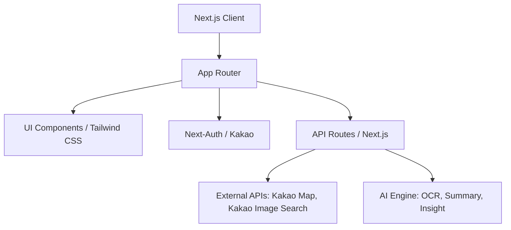
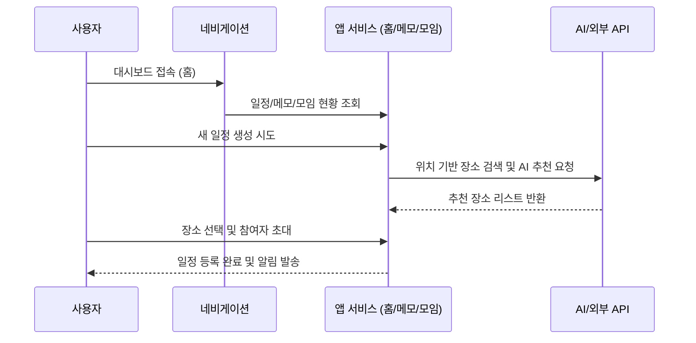

# 📄 MOYEOLOG (모여로그) 프로젝트 기획서

## 1. 프로젝트 개요
**모여로그(MOYEOLOG)**는 개인의 일정 관리와 그룹 간의 메모 공유, 모임 조율을 하나로 통합한 스마트 협업 플랫폼입니다. AI 기술을 활용하여 사용자에게 최적화된 인사이트와 장소 추천 서비스를 제공합니다.

## 2. 기획 배경 및 목적
### 🔍 기획 배경
- **파편화된 도구:** 일정은 캘린더, 메모는 노트 앱, 모임 조율은 메신저로 분산되어 있어 정보의 통합 관리가 어려움.
- **오프라인 모임의 번거로움:** 모임 장소 선정, 참여자 확인, 모임 후 기록 공유 과정에서 발생하는 번거로움 해결 필요.
- **데이터 활용 미흡:** 단순 기록에 그치는 메모와 일정을 AI가 분석하여 유의미한 정보(요약, 장소 추천 등)로 변환하고자 함.

### 🎯 목적
- 개인과 그룹의 일정을 효율적으로 관리하는 **통합 대시보드** 제공.
- AI 기반의 **자동 요약 및 OCR 기능**으로 기록의 편의성 극대화.
- 실시간 장소 검색 및 AI 추천을 통한 **스마트한 모임 계획** 지원.

## 3. 플랫폼 및 타겟층
### 📱 플랫폼
- **Web:** Next.js 기반의 반응형 웹 애플리케이션 (PC 및 모바일 브라우저 최적화)

### 👥 주요 타겟층
- **대학생 및 스터디 그룹:** 과제, 시험 일정 공유 및 스터디 기록 관리.
- **직장인 동호회 및 소모임:** 주기적인 모임 일정 조율 및 활동 기록 공유.
- **자기계발러:** 개인의 성취 기록(메모)과 일정을 체계적으로 관리하고 싶은 개인 사용자.

## 4. 서비스 구조 (Architecture)

## 5. 서비스 플로우 (User Flow)

## 6. 주요 기능 및 기대효과
### ✨ 주요 기능
1. **스마트 캘린더:** 개인 및 그룹 일정을 한눈에 확인하고 즉시 생성.
2. **AI 메모 보관함:** OCR을 통한 텍스트 추출, 자동 요약, 감정 분석 및 키워드 추출.
3. **실시간 모임 추천:** 카카오맵 API 연동을 통한 최적의 모임 장소 추천 및 이미지 미리보기.
4. **그룹 소통:** 모임별 전용 메모 공간 및 참여자 관리 시스템.

### 📈 기대효과
- **시간 절약:** AI 추천 및 요약 기능을 통해 정보 정리 및 장소 선정 시간 단축.
- **협업 효율 증대:** 그룹 멤버 간 실시간 정보 공유로 소통 오류 방지.
- **기록의 가치화:** 단순 텍스트 기록을 데이터 기반의 인사이트로 변환하여 사용자 경험 향상.

## 7. 개발 현황 (Current Status)
현재 프로젝트는 **프론트엔드 핵심 UI 및 주요 API 연동 단계**에 있습니다.

| 단계 | 기능 항목 | 상태 | 비고 |
| :--- | :--- | :---: | :--- |
| **디자인/UI** | GNB, 사이드바, 공통 모달 시스템 | ✅ | Tailwind CSS 기반 고도화 완료 |
| **메모** | 그리드/리스트 뷰, 생성 및 상세 모달 | ✅ | UI 구현 및 목데이터 연동 완료 |
| **홈/일정** | 캘린더 UI, 일정 생성 모달 | ✅ | 카카오맵 연동 및 장소 추천 완료 |
| **외부 API** | 카카오맵, 카카오 이미지 검색 | ✅ | API Route를 통한 프록시 연동 완료 |
| **인증** | Next-Auth (Kakao) | 🏃 | 기본 구조 설정 완료, 연동 진행 중 |
| **AI 연동** | OCR, 요약, 인사이트 로직 | 📅 | UI는 구현 완료, 실제 로직 연동 예정 |
| **백엔드** | 데이터베이스 및 실시간 데이터 연동 | 📅 | 예정 |

---
*최종 업데이트: 2026-04-13*
