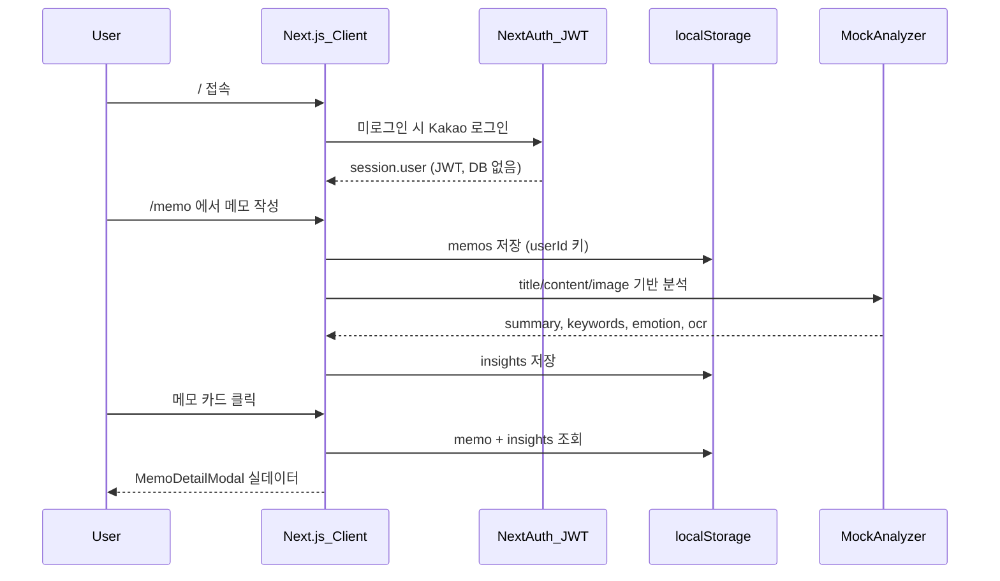

# MOYEOLOG 세로 슬라이스 (프론트엔드 전용)

> **제약:** 별도 백엔드·MySQL 미구축 → Prisma, 메모 API Route, DB upsert **제외**  
> **유지:** 기존 NextAuth(Kakao) Route, 카카오맵/이미지 프록시 등 이미 있는 Next.js API는 그대로 사용

## 목표 흐름



## 현재 상태 vs 이번 작업

| 영역 | 현재                    | 이번 작업 (서버 없음)                              |
| ---- | ----------------------- | -------------------------------------------------- |
| 인증 | Provider만 설정         | JWT 세션 + middleware 라우트 보호 (DB upsert 없음) |
| 메모 | 하드코딩 8건            | `localStorage` + 사용자별 키                       |
| AI   | 상세 모달 고정 문자열   | 클라이언트 목 분석기 (Gemini API Route는 **후속**) |
| 저장 | 저장 버튼이 `onClose`만 | 폼 상태 → storage → 분석 → 목록 갱신               |

**이번 범위 밖:** Prisma/MySQL, `/api/memos`, Gemini 서버 프록시, 일정·모임 CRUD

**서버 구축 후 교체 지점:** `memo-storage.ts`, `memo-analyzer.ts` 내부만 API 호출로 스왑 (UI 변경 최소화)

---

## 1. 데이터 모델 & localStorage 레이어

[`sql.md`](sql.md) 필드를 **TypeScript 타입**으로만 반영 (DB 없음).

**신규 파일**

- `src/types/memo.ts`

```ts
export type Memo = {
  id: string;
  authorId: string; // session.user.id (JWT sub)
  title: string;
  content: string;
  imageDataUrl?: string; // base64 (10MB 이하, 슬라이스용)
  tags: string[];
  createdAt: string;
  updatedAt: string;
};

export type MemoAiInsight = {
  memoId: string;
  ocrText: string;
  summary: string;
  emotion: string;
  keywords: string[];
  analyzedAt: string;
};
```

- `src/lib/memo-storage.ts`
  - 키: `moyeolog:memos:{userId}`, `moyeolog:insights:{userId}`
  - `listMemos(userId)`, `getMemo(userId, id)`, `createMemo`, `updateMemo`, `saveInsight`
  - 초기 시드: 기존 mock 8건을 **최초 1회** 마이그레이션 (빈 storage일 때만) → UI 깨짐 방지
  - `crypto.randomUUID()` 로 id 생성

**이미지:** `FileReader` → `data:` URL로 저장 (새로고침 후에도 유지). 10MB 초과 시 저장 전 alert.

---

## 2. 클라이언트 AI 분석 (목 구현)

**신규:** `src/lib/memo-analyzer.ts`

- `analyzeMemo(input: { title, content, imageDataUrl? }): Promise<MemoAiInsight>`
- **목 로직 (Gemini 대체):**
  - `summary`: 본문 앞 120자 요약 또는 문장 단위 축약
  - `keywords`: 본문+제목에서 2~4글자 이상 토큰 빈도 상위 5개 (간단 분리)
  - `emotion`: 긍정/부정 키워드 사전 휴리스틱 → `긍정` / `중립` / `부정`
  - `ocr_text`: 이미지 있으면 `"[이미지 첨부됨] OCR은 서버 연동 후 제공됩니다"` 또는 파일명 기반 placeholder; 없으면 본문 일부
- `delay(800ms)` 로 로딩 UX
- **향후:** 동일 시그니처로 `fetch('/api/memos/[id]/analyze')` 호출만 교체

> Gemini 실연동은 `GEMINI_API_KEY` + Route Handler 필요 → **서버 구축 단계**로 이관 (계획에 인터페이스만 유지)

---

## 3. NextAuth (DB 없이) + 라우트 가드

**신규:** `src/lib/auth.ts` — `authOptions` export (DB 콜백 **없음**)

- `session` 콜백: `session.user.id = token.sub` (카카오 계정 식별자)
- `types/next-auth.d.ts` 타입 확장

**`src/middleware.ts`**

- `withAuth` 또는 `getToken`으로 보호: `/home`, `/memo`, `/schedule`, `/groups`, `/friends`, `/notifications`, `/settings`
- 미로그인 → `/`
- 로그인 상태에서 `/` → `/memo`

**[`src/app/page.tsx`](src/app/page.tsx)**

- MOYEOLOG 로그인 랜딩 + `signIn("kakao", { callbackUrl: "/memo" })`

**[`Navbar.tsx`](src/components/Navbar.tsx) / [`ProfileModal.tsx`](src/components/ProfileModal.tsx)**

- placeholder 제거, `useSession` 프로필 표시

---

## 4. UI 연동

### [`MemoCreateModal.tsx`](src/components/MemoCreateModal.tsx)

- controlled state: `title`, `content`, `tags[]`, `imageFile`
- 파일 업로드 + 드래그앤드롭 + 미리보기
- **저장:** `createMemo` → `analyzeMemo` → `saveInsight` → `onSuccess(memoId)`
- 로딩/에러 UI
- AI 사이드바 버튼: 저장 시 자동 분석 (또는 "분석 미리보기"로 `analyzeMemo`만 호출)

### [`src/app/memo/page.tsx`](src/app/memo/page.tsx)

- `useSession` → `userId` 확보 후 `listMemos` 로드
- mock 상수 배열 제거, storage 기반 렌더
- `MemoCreateModal` `onSuccess` → state 갱신
- 카드 클릭 → `memoId` + storage 데이터로 상세 모달

### [`MemoDetailModal.tsx`](src/components/MemoDetailModal.tsx)

- props: `memoId`, `userId` (또는 memo 객체 직접 전달)
- `getMemo` + insight 조회 → 요약/키워드/감정/OCR/본문/이미지 표시
- insight 없으면 "분석 중…" 스켈레톤 후 재조회

### 기타

- [`layout.tsx`](src/app/layout.tsx) metadata → MOYEOLOG
- 홈 [`home/page.tsx`](src/app/home/page.tsx) 메모 섹션: storage에서 최신 3건 표시 (선택, 슬라이스 마무리 시)

---

## 5. 환경 변수 (이번 단계)

```env
KAKAO_CLIENT_ID=
KAKAO_CLIENT_SECRET=
NEXTAUTH_SECRET=
NEXTAUTH_URL=http://localhost:3000
NEXT_PUBLIC_KAKAO_MAP_API_KEY=
# GEMINI_API_KEY — 서버 구축 후 추가
# DATABASE_URL — 서버 구축 후 추가
```

`.env.example`에 위만 문서화 (DB/Gemini는 주석으로 후속 표기)

---

## 6. 검증 시나리오

1. `/` → 카카오 로그인 → `/memo`, GNB 실제 닉네임
2. 새 메모 작성(제목+본문+선택 이미지) → 저장 → 목록에 표시
3. 카드 클릭 → AI 요약/키워드/감정/OCR 영역에 **저장된 insight** 표시 (목 분석)
4. 새로고침 후에도 메모·insight 유지 (localStorage)
5. 로그아웃 후 `/memo` 직접 접근 → `/` 리다이렉트
6. DevTools → Application → localStorage 키 확인

---

## 7. 구현 순서

1. `types/memo.ts` + `memo-storage.ts` (+ 초기 시드)
2. `memo-analyzer.ts` (목 AI)
3. `lib/auth.ts` + middleware + 로그인 페이지 + Navbar
4. MemoCreateModal → memo/page → MemoDetailModal
5. (선택) home 메모 섹션 storage 연동
6. GEMINI.md / 기획서 현황 표 업데이트

---

## 8. 서버 구축 후 마이그레이션 (참고만, 이번 미구현)

| 클라이언트            | 서버 대체                                   |
| --------------------- | ------------------------------------------- |
| `memo-storage.ts`     | Prisma + `/api/memos`                       |
| `memo-analyzer.ts`    | `lib/gemini.ts` + `/api/memos/[id]/analyze` |
| `authorId: token.sub` | `users` 테이블 UUID                         |
| localStorage 시드     | DB seed / 빈 상태                           |

localStorage 데이터는 수동 이관 스크립트 또는 1회 import API로 후속 처리 가능.

## 리스크 / 완화

- **localStorage 용량:** 이미지 base64는 용량 큼 → 10MB 제한, 장기적으로 서버 업로드
- **사용자별 격리:** 키에 `userId` 포함, 로그아웃 시 다른 계정 데이터와 분리
- **목 AI 품질:** UI/플로우 검증용; 실제 Gemini는 서버 단계에서 교체
